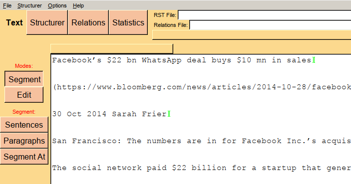

# RSTTool by Michael O'Donnell, Wagsoft Linguistic Software

The RSTTool is a classic, but dated annotation tool for creating annotations according to Rhetorical Structure Theory (RST).

## Starting

Under Linux, run 

	bash -e rsttool.sh

or

	./rsttool.sh

Optionally, this can be followed by a file to be loaded, but this seems to only support only `*.rs3`  and (RST-)XML files. Default is (RST-)XML.

> As of May 2025, the Linux edition of RSTTool 3.42 is not runnable under Ubuntu 22.04L because its depends on TCL/TK 8.3.
> Instead, `rsttool.sh` uses the [Windows version 3.45](./www.wagsoft.com/RSTTool/RSTTool345Install.exe) that can be unzipped and executed with `wine` (wine-6.0.3, Ubuntu 6.0.3~repack-1).

## Import and Segment Text

It is not possible to provide a text file for annotation as argument to the RSTTool. Instead, use the "Import text" dialog under "File". Note that the RSTTool will always start at its home directory, so you need to click to the actual place of your file. After importing, you need to segment.

For segmenting, go to the "Text" tab. 
You can segment manually. But also, you can let it segment. Unfortunately, it does not recognize line breaks as sentence boundaries

- DON'T use "Segment"/"Sentences": It will treat every `[.!?]` as a sentence boundary marker, regardless of context.
- If you have (EDU-)segmented data, replace all sentence boundaries (e.g., line breaks) by double line breaks and segment by "Segment"/"Paragraphs". 

	Example for rendering a Markdown file:

		$> pandoc bloomberg.md  \
		   | perl -pe 's/\s+/ /g; s/<br[^>]*>|<\/p>|<\/h[0-9][^>]*>/\n/g; s/<[^>]*>//g;' \
		   | perl -pe 's/^\s+//g; s/ +/ /g; s/$/\n/g' \
		   > bloomberg.txt

	> Note that this means you mess up (the whitespaces in) your source text. This can be re-aligned using [CoNLL-Merge](https://github.com/acoli-repo/conll-merge).

## Annotate, Save and Export

From the [RSTTool Version 3.0 Users Guide by Michael O'Donnell](http://www.wagsoft.com/RSTTool/):

1. [Structuring Text](./www.wagsoft.com/RSTTool/section5.html.md)
2. [Dealing with Relations](./www.wagsoft.com/RSTTool/section6.html.md)
3. [Printing and Saving Diagrams](./www.wagsoft.com/RSTTool/section7.html.md)
4. [Statistics](./www.wagsoft.com/RSTTool/section8.html.md)
5. [The Menus](./www.wagsoft.com/RSTTool/section9.html.md)

Exporting as images:

- Printing to PS via "Structurer"/"Print Diagram" normally works, but these files are hard to post-process. Conversion to PDF will crop it to a single page.
- Better export to `*.emf` (Windows enhanced MetaFile). These can be opened by Inkscape and further processed as SVG.
- The rotated view obfuscates RST structure.
- For exporting an RST tree, you can collapse sub-trees.

## Background on RST

From [Maite Taboada's RST Web Site](https://www.sfu.ca/rst/):

1. [Intro to RST](./www.sfu.ca/rst/01intro/intro.md)
2. [RST Definitions](./www.sfu.ca/rst/01intro/definitions.txt)
3. [Sample Analyses](https://www.sfu.ca/rst/02analyses/index.html) (RS3 and PDF)
4. [RST Bibliography](https://www.sfu.ca/rst/05bibliographies/index.html) (until 2023)

## Content

- [`www.wagsoft.com`](./www.wagsoft.com) Full mirror of the RSTTool website from 2025-05-22 in case the original hosting falters. Includes binaries.
- [`www.sfu.ca`](./www.sfu.ca) Full mirror of the RST website from 2025-05-22. Development stalled in January 2024.

## Notes

- https://www.sfu.ca/rst/: The home of RST, development stalled in January 2024
- https://wiki.gucorpling.org/gum/rst: Some alternative tooling, incl. https://gucorpling.org/rstweb/info/ (server-side annotation tool)

