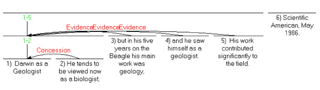

# History

RST was originally developed as part of studies of computer-based
text generation. A team at Information Sciences Institute (part of
University of Southern California) was working on computer-based
authoring. In about 1983, part of the team (Bill Mann, Sandy
Thompson and Christian Matthiessen) noted that there was no
available theory of discourse structure or function that provided
enough detail to guide programming any sort of author.

Responding to this lack, RST was developed out of studies of
edited or carefully prepared text from a wide variety of sources.
It now has a status in linguistics that is independent of its
computational uses.

# Texts, Coherence and Structure

In ordinary usage, a text has a kind of unity that arbitrary
collections of sentences or other language generally lack.

RST offers an explanation of the coherence of texts. But what is
coherence? One formulation of coherence is that it is the absence
of non-sequiturs and gaps. That is, for every part of a coherent
text, there is some function, some plausible reason for its
presence, evident to readers, and furthermore, there is no sense
that some parts are somehow missing. RST focuses on the first part
-- an evident role for every part.

# Structures

RST is intended to describe texts, rather than the processes of
creating or reading and understanding them. It posits a range of
possibilities of structure -- various sorts of "building blocks"
which can be observed to occur in texts. These "blocks" are at two
levels, the principal one dealing with "nuclearity" and
"relations" (often called coherence relations in the linguistic
literature). A second level of structures, called schemas, is not
presented here.

## Nucleus::Satellite Relations

The most frequent structural pattern is that two spans of text
(virtually always adjacent, but exceptions can be found) are
related such that one of them has a specific role relative to the
other. A paradigm case is a claim followed by evidence for the
claim. RST posits an "Evidence" relation between the two spans. It
also says that the claim is more essential to the text than the
particular evidence, and this essentiality is represented by
calling the claim span a nucleus and the evidence span a satellite
. The order of spans is not constrained, but there are more likely
and less likely orders for all of the relations.

Other comparable sorts of pairs have also been identified:

    ┌─────────────┬────────────────────────┬─────────────────────────┐
    │  Relation   │        Nucleus         │        Satellite        │
    │    Name     │                        │                         │
    ├─────────────┼────────────────────────┼─────────────────────────┤
    │ Background  │ text whose             │ text for facilitating   │
    │             │ understanding is being │ understanding           │
    │             │ facilitated            │                         │
    ├─────────────┼────────────────────────┼─────────────────────────┤
    │ Elaboration │ basic information      │ additional information  │
    ├─────────────┼────────────────────────┼─────────────────────────┤
    │ Preparation │ text to be presented   │ text which prepares the │
    │             │                        │ reader to expect and    │
    │             │                        │ interpret the text to   │
    │             │                        │ be presented.           │
    └─────────────┴────────────────────────┴─────────────────────────┘

If a relation does not have a particular span of text which is
more central to the author’s purposes, it is called Multinuclear.
An example is the neutral Contrast relation.

    ┌─────────────┬────────────────────────┬─────────────────────────┐
    │  Relation   │          Span          │       Other Span        │
    │    Name     │                        │                         │
    ├─────────────┼────────────────────────┼─────────────────────────┤
    │ Contrast    │ one alternate          │ the other alternate     │
    └─────────────┴────────────────────────┴─────────────────────────┘

### Lactose Example

With just those relations, we can illustrate the analysis of a
text. Here are a title and abstract from the beginning of a
Scientific American article. The abstract has been broken into
numbered units for analysis.

### What is Analysis?

The analysis process is intended to give a structured, definite
way for a person who understands the text to state a part of what
that understanding includes. The analyst (generally called the
observer in RST papers) is saying that in his or her own view, the
first two units (those that explain the terms lactose and lactase)
are intended to facilitate understanding of the rest of the text.
Also, that unit 2) is providing additional detail about the
subject matter (or more generally, the situation) presented in
unit 1). Also, that units 3) and 4) are in a neutral contrast
relation. Each of these observations is formulated in terms of
author’s intention, so that, for example, the author intended that
the reader recognize that the situations expressed in 3) and 4)
are similar in many ways, but are different in a way that the
author wanted to express.

There is nothing in RST which would force the observer to find
some structural role for every element of the text. Even so, for
carefully written texts, virtually every text has an RST analysis
that provides a structural place for every element of the text.
(Sometimes because of text complexity or ambiguity, the observer
may provide more than one analysis.)

### More Relations

A set of relations is informally presented below. Full relation
definitions and examples are available from the definitions page.
The set of relations is in principle open, but the set above,
defined in Mann & Thompson 1988 (which is currently the definitive
paper on RST) has proven effective for many purposes. In the
definitions page a distinction is made between Subject-Matter
relations and Presentational relations. Subject-Matter relations
express parts of the subject matter of the text. The
Presentational relations facilitate the presentation process.

If you are viewing this on the RST web site, you might want to
look at some other examples of RST analysis. On the list of
unpublished analyses, look at one marked "Sparky Lived!". On the
list of published analyses, look for one marked "It's not laziness
". This introductory paper relies on the other examples on the web
site, as well as the bibliographies.

    ┌────────────────┬────────────────────────┬───────────────────────┐
    │ Relation Name  │        Nucleus         │       Satellite       │
    ├────────────────┼────────────────────────┼───────────────────────┤
    │ Antithesis     │ ideas favored by the   │ ideas disfavored by   │
    │                │ author                 │ the author            │
    ├────────────────┼────────────────────────┼───────────────────────┤
    │ Background     │ text whose             │ text for facilitating │
    │                │ understanding is being │ understanding         │
    │                │ facilitated            │                       │
    ├────────────────┼────────────────────────┼───────────────────────┤
    │ Circumstance   │ text expressing the    │ an interpretive       │
    │                │ events or ideas        │ context of situation  │
    │                │ occurring in the       │ or time               │
    │                │ interpretive context   │                       │
    ├────────────────┼────────────────────────┼───────────────────────┤
    │ Concession     │ situation affirmed by  │ situation which is    │
    │                │ author                 │ apparently            │
    │                │                        │ inconsistent but also │
    │                │                        │ affirmed by author    │
    ├────────────────┼────────────────────────┼───────────────────────┤
    │ Condition      │ action or situation    │ conditioning          │
    │                │ whose occurrence       │ situation             │
    │                │ results from the       │                       │
    │                │ occurrence of the      │                       │
    │                │ conditioning situation │                       │
    ├────────────────┼────────────────────────┼───────────────────────┤
    │ Elaboration    │ basic information      │ additional            │
    │                │                        │ information           │
    ├────────────────┼────────────────────────┼───────────────────────┤
    │ Enablement     │ an action              │ information intended  │
    │                │                        │ to aid the reader in  │
    │                │                        │ performing an action  │
    ├────────────────┼────────────────────────┼───────────────────────┤
    │ Evaluation     │ a situation            │ an evaluative comment │
    │                │                        │ about the situation   │
    ├────────────────┼────────────────────────┼───────────────────────┤
    │ Evidence       │ a claim                │ information intended  │
    │                │                        │ to increase the       │
    │                │                        │ reader’s belief in    │
    │                │                        │ the claim             │
    ├────────────────┼────────────────────────┼───────────────────────┤
    │ Interpretation │ a situation            │ an interpretation of  │
    │                │                        │ the situation         │
    ├────────────────┼────────────────────────┼───────────────────────┤
    │ Justify        │ text                   │ information           │
    │                │                        │ supporting the        │
    │                │                        │ writer’s right to     │
    │                │                        │ express the text      │
    ├────────────────┼────────────────────────┼───────────────────────┤
    │ Motivation     │ an action              │ information intended  │
    │                │                        │ to increase the       │
    │                │                        │ reader’s desire to    │
    │                │                        │ perform the action    │
    ├────────────────┼────────────────────────┼───────────────────────┤
    │ Non-volitional │ a situation            │ another situation     │
    │ Cause          │                        │ which causes that     │
    │                │                        │ one, but not by       │
    │                │                        │ anyone’s deliberate   │
    │                │                        │ action                │
    ├────────────────┼────────────────────────┼───────────────────────┤
    │ Non-volitional │ a situation            │ another situation     │
    │ Result         │                        │ which is caused by    │
    │                │                        │ that one, but not by  │
    │                │                        │ anyone’s deliberate   │
    │                │                        │ action                │
    ├────────────────┼────────────────────────┼───────────────────────┤
    │ Otherwise      │ action or situation    │ conditioning          │
    │ (anti          │ whose occurrence       │ situation             │
    │ conditional)   │ results from the lack  │                       │
    │                │ of occurrence of the   │                       │
    │                │ conditioning situation │                       │
    ├────────────────┼────────────────────────┼───────────────────────┤
    │ Purpose        │ an intended situation  │ the intent behind the │
    │                │                        │ situation             │
    ├────────────────┼────────────────────────┼───────────────────────┤
    │ Restatement    │ a situation            │ a reexpression of the │
    │                │                        │ situation             │
    ├────────────────┼────────────────────────┼───────────────────────┤
    │ Solutionhood   │ a situation or method  │ a question, request,  │
    │                │ supporting full or     │ problem, or other     │
    │                │ partial satisfaction   │ expressed need        │
    │                │ of the need            │                       │
    ├────────────────┼────────────────────────┼───────────────────────┤
    │ Summary        │ text                   │ a short summary of    │
    │                │                        │ that text             │
    ├────────────────┼────────────────────────┼───────────────────────┤
    │ Volitional     │ a situation            │ another situation     │
    │ Cause          │                        │ which causes that     │
    │                │                        │ one, by someone’s     │
    │                │                        │ deliberate action     │
    ├────────────────┼────────────────────────┼───────────────────────┤
    │ Volitional     │ a situation            │ another situation     │
    │ Result         │                        │ which is caused by    │
    │                │                        │ that one, by          │
    │                │                        │ someone’s deliberate  │
    │                │                        │ action                │
    └────────────────┴────────────────────────┴───────────────────────┘

## Multinuclear Relations

In addition to this most frequent pattern of nucleus and
satellite, there are relations that do not carry a definite            
selection of one nucleus. We saw an example, Contrast, above.
These are called multinuclear relations. They are:

    ┌─────────────┬─────────────────────────┬────────────────────────┐
    │ Relation    │ Span                    │ Other Span             │
    │ Name        │                         │                        │
    ├─────────────┼─────────────────────────┼────────────────────────┤
    │ Contrast    │ one alternate           │ the other alternate    │
    ├─────────────┼─────────────────────────┼────────────────────────┤
    │ Joint       │ (unconstrained)         │ (unconstrained)        │
    ├─────────────┼─────────────────────────┼────────────────────────┤
    │ List        │ an item                 │ a next item            │
    ├─────────────┼─────────────────────────┼────────────────────────┤
    │ Sequence    │ an item                 │ a next item            │
    └─────────────┴─────────────────────────┴────────────────────────┘

# Observers and Definitions

RST is designed to enable the analysis of texts. There is a
graphical convention for expressing the structures of texts, but
the particular claims made by the analyst can be made explicit
based on the definitions of the relations and other structures of
RST. Analysts are free to extend the set of definitions where a
prior set is inadequate.

What does an analysis do? It is a symbolic medium in which a
trained reader can account for: the sense of unity, connectedness
and coherence of ordinary written monologues, in such a way that
the analysis consists of explicit claims.

Each relation has a definition. The definition specifies what a
reader of a text must judge to be true in order to include that
relation between two spans in an analysis of that text.

A typical relation definition is the following, in an abbreviated
form, for the "Condition" relation. It illustrates both the
specific definition and also the general form of all of the
definitions. It is intended to be applied in a systematic way by a
person, called an observer in RST.

    ┌────────────────────────────────────────────────────────────────┐
    │                           Condition                            │
    ├───────────────────────────────┬────────────────────────────────┤
    │ Definitional Element          │ Observer’s Finding             │
    ├───────────────────────────────┼────────────────────────────────┤
    │ constraints on the nucleus,   │ (none)                         │
    │ N:                            │                                │
    ├───────────────────────────────┼────────────────────────────────┤
    │ constraints on the satellite, │ S presents a hypothetical,     │
    │ S:                            │ future, or otherwise           │
    │                               │ unrealized situation (relative │
    │                               │ to the situational context of  │
    │                               │ S)                             │
    ├───────────────────────────────┼────────────────────────────────┤
    │ constraints on the N + S      │ Realization of the situation   │
    │ combination:                  │ presented in N depends on      │
    │                               │ realization of that presented  │
    │                               │ in S                           │
    ├───────────────────────────────┼────────────────────────────────┤
    │ the effect (intended by the   │ R recognizes how the           │
    │ author in using this relation │ realization of the situation   │
    │ in addressing reader R; never │ presented in N depends on the  │
    │ empty):                       │ realization of the situation   │
    │                               │ presented in S                 │
    ├───────────────────────────────┼────────────────────────────────┤
    │ locus of the effect (derived  │ N and S                        │
    │ from the effect):             │                                │
    └───────────────────────────────┴────────────────────────────────┘

Since the effect is never empty, every observation of a relation
ascribes an intention to the author concerning the spans of text
that are linked by the relation. Projecting this to an analysis
that provides a role for every span, this ascribes an intention, a
reason for the presence of every element of the text.

An observer examines the text and finds consistent combinations of
spans and relations (and other structures) that encompass the
entire text. A text may have more than one analysis, either
because the observer finds ambiguity or finds that a combination
of analyses best represents the author’s intent. Such a
combination will often not form a tree, but the combinations
themselves are fairly rare.

The "abbreviation" referred to above is intended to clarify the
epistemological status of observations. For each of the Observer’s
Findings above, the observer is stating that "It is plausible to
the observer that it was plausible to the author writing the text
that <the finding> holds.

The primary influence on the organization and level of detail of
the definitions was to make the observation process always
performable.

## Darwin Analysis Example with Claims

Here is an analysis example. It is an abstract from an article in
Scientific American, May 1986, entitled "Darwin as a Geologist".
For analysis it has been predivided into five units on syntactic
grounds, including the title as a unit.

1) Darwin as a Geologist 2) He tends to be viewed now as a
biologist, 3) but in his five years on the Beagle his main work
was geology, 4) and he saw himself as a geologist. 5) His work
contributed significantly to the field.

The RST diagram is as follows:

 

Claims of the Observer:

The table below shows the claims made by the observer in positing
the first Evidence relation in the Darwin example:

    ┌──────────┬─────────┬───────────┬────────────────┬─────────────────┐
    │ Relation │ Nuclear │ Satellite │    Generic     │ Specific Claim, │
    │          │  Span   │   Span    │  Constraint,   │   fuller form   │
    │          │         │           │   short form   │                 │
    ├──────────┼─────────┼───────────┼────────────────┼─────────────────┤
    │ Evidence │ 1-2     │ 3         │ Reader might   │ It is plausible │
    │          │         │           │ not believe    │ to the Observer │
    │          │         │           │ Nucleus to a   │ that it was     │
    │          │         │           │ degree         │ plausible to    │
    │          │         │           │ satisfactory   │ the Author that │
    │          │         │           │ to the Author. │ the Reader      │
    │          │         │           │                │ might not       │
    │          │         │           │                │ believe that    │
    │          │         │           │                │ Darwin worked   │
    │          │         │           │                │ as a geologist  │
    │          │         │           │                │ to a degree     │
    │          │         │           │                │ satisfactory to │
    │          │         │           │                │ the Author      │
    ├──────────┼─────────┼───────────┼────────────────┼─────────────────┤
    │          │ 1-2     │ 3         │ Reader         │ It is plausible │
    │          │         │           │ believes       │ to the Observer │
    │          │         │           │ Satellite or   │ that it was     │
    │          │         │           │ will find it   │ plausible to    │
    │          │         │           │ credible.      │ the Author that │
    │          │         │           │                │ the Reader      │
    │          │         │           │                │ believes or     │
    │          │         │           │                │ will find it    │
    │          │         │           │                │ credible that   │
    │          │         │           │                │ Darwin worked   │
    │          │         │           │                │ as a geologist  │
    ├──────────┼─────────┼───────────┼────────────────┼─────────────────┤
    │          │ 1-2     │ 3         │ Reader’s       │ It is plausible │
    │          │         │           │ comprehending  │ to the Observer │
    │          │         │           │ Satellite      │ that it was     │
    │          │         │           │ increases      │ plausible to    │
    │          │         │           │ Reader’s       │ the Author that │
    │          │         │           │ belief of      │ Comprehending   │
    │          │         │           │ Nucleus.       │ that Darwin’s   │
    │          │         │           │                │ main work on    │
    │          │         │           │                │ the Beagle was  │
    │          │         │           │                │ geology will    │
    │          │         │           │                │ tend to         │
    │          │         │           │                │ increase the    │
    │          │         │           │                │ belief of the   │
    │          │         │           │                │ reader that     │
    │          │         │           │                │ Darwin worked   │
    │          │         │           │                │ as a geologist. │
    ├──────────┼─────────┼───────────┼────────────────┼─────────────────┤
    │          │ 1-2     │ 3         │ Reader’s       │ It is plausible │
    │          │         │           │ belief of      │ to the Observer │
    │          │         │           │ Nucleus is     │ that the Author │
    │          │         │           │ increased      │ wanted the      │
    │          │         │           │                │ Reader’s belief │
    │          │         │           │                │ that Darwin     │
    │          │         │           │                │ worked as a     │
    │          │         │           │                │ geologist to be │
    │          │         │           │                │ increased.      │
    └──────────┴─────────┴───────────┴────────────────┴─────────────────┘

These claims, together with those for the other two Evidence
relations and the Concession relation, are a set of 16 or so
claims. They are essentially equivalent to the diagram.

The possibility of enumerating the specific claims of the analysis
is what makes RST analyses comparable to other approaches,
provided of course that the others are sufficiently explicit.

# Implicit Communication based on Rhetorical Relations

Aside from the explicitness of the task, the observer is in a
position not very different from that of the reader of the text.
The relations that the observer finds plausible will generally be
plausible to the reader as well.

The relations, as well as the clauses of the text, carry
communicative content. For example, consider the idea that because
Darwin contributed significantly to geology, that is evidence that
Darwin worked as a geologist. The notion of evidence is nowhere
explicit in the example text, but it is conveyed nevertheless. If
the text is changed so that it somehow denies the idea that this
contribution is evidence for such working, then it becomes
incoherent, but not contradictory. The evidence idea, implicitly
conveyed, is part of what the text communicates. In various papers
on RST, primarily from 1985 to 1992, these were called relational
propositions. This implicit communication contributes
significantly to the possibility of "reading between the lines,"
of finding that, routinely, implicit communication arises by
reading texts.

# Summary

Because RST generally provides an analysis for any coherent
carefully written text, and because such an analysis provides a
motivated account of why each element of the text has been
included by the author, it gives an account of textual coherence
that is independent of the lexical and grammatical forms of the
text. Because of its specification of the role of the observer, it
provides a basis for statements about the objectivity and
subjectivity of the analysis. It also provides a functional basis
for studying the discourse-relevant specific forms in texts,
"discourse markers" and other formal correlates of discourse
structure. Where RST posits structure within sentences, it
provides a basis for studying the functions of various forms of
clause combining, and more generally the relationships between
these sorts of discourse structure and various cohesive devices.

# Reference

Mann, W.C., & Thompson, S.A. 1988. Rhetorical Structure Theory:
Toward a functional theory of text organization. Text, 8 (3).
243-281.

©2005-2025 William C. Mann, Maite Taboada. All rights reserved.
