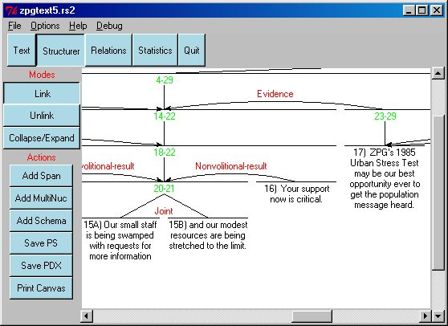
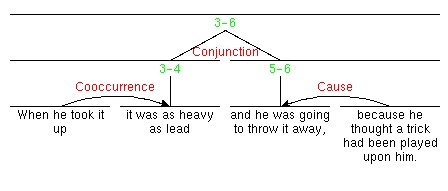
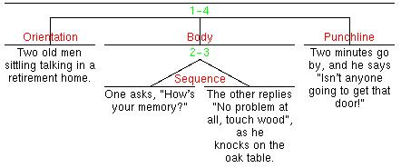

 

# 5. Structuring Text {#structuring-text align="center"}

 

The next step involves structuring the text. The second interface of the
RSTTool allows the user to connect the segments into a rhetorical
structure tree, as shown in figure 2. We have followed the graphical
style presented in Mann & Thompson (1987).\
 

\
Figure 2: The Structurer interface.

Initially, all segments are unconnected, ordered at the top of the
window. The user can then drag the mouse from one segment (the satelite)
to another (the nucleus) to link them (see instructions below).

The system allows both plain RST relations and also multi-nuclear
relations (e.g., joint, sequence, etc.). Scoping is also possible,
whereby the user indicates that the nucleus of a relation is not a
segment itself, but rather a segment and all of its satellites. See
figure 3 for an example combining normal RST relations (Coocurrence,
Cause); multi-nuclear structure (Conjunction), and scoping (the nodes
marked 3-4 and 5-6). In addition, McKeon-style *schemas* can be used to
represent constituency-type structures. See figure 4.

\
Figure 3: RST Structuring

 

\
Figure 4: Schema-based Structuring

**Where to Click**: For all interface actions involving clicking on the
interface, a box will appear under the nodes which are valid to click
upon when the mouse cursor is over them. For instance, in link mode,
only those text nodes which are not currently a satelite of any node
will hilight. When dragging from a satelite to a nucleus, only those
objects on the screen which can be dragged to will be boxed. Note
however that boxing does not apply to actions such as changing relation
names (see below) or collapse/expand of structure.

In the following, \"clicking\" on a node implies the left button on
multiple-mouse systems (e.g., Sun, PC).

    +-----------------------------------+-----------------------------------+
    | **Structuring Operations**        |                                   |
    +-----------------------------------+-----------------------------------+
    | **Linking Nodes**                 | **To link two nodes**:            |
    |                                   |                                   |
    |                                   | 1.  Make sure you are in the      |
    |                                   |     \"Link\" mode: the \"Link\"   |
    |                                   |     button should be depressed,   |
    |                                   |     and the cursor should change  |
    |                                   |     to a \"\<-\>\" (only when     |
    |                                   |     over the edit canvas).        |
    |                                   | 2.  Then, click down on the       |
    |                                   |     satelite node and drag to the |
    |                                   |     nucleus (following the        |
    |                                   |     direction in which the RST    |
    |                                   |     arrow should be drawn). Then  |
    |                                   |     Release.                      |
    |                                   | 3.  A menu will be offered of the |
    |                                   |     available relations. Select   |
    |                                   |     one by clicking on it.        |
    |                                   | 4.  The nodes will then be        |
    |                                   |     linked.                       |
    |                                   |                                   |
    |                                   | **Where to Click: ** when         |
    |                                   | connecting two nodes,  you need   |
    |                                   | to click on the \'text\' part of  |
    |                                   | the node. This will be the text   |
    |                                   | of a leaf node.  For span,        |
    |                                   | multinuclear and schema nodes,    |
    |                                   | click on the text indicating the  |
    |                                   | span (e.g., 1-3). The applicable  |
    |                                   | screen objects will be boxed when |
    |                                   | the mouse is over them.           |
    |                                   |                                   |
    |                                   | **Illegal Links**: If the link is |
    |                                   | illegal for some reason (e.g.,    |
    |                                   | the satelite already has a        |
    |                                   | nucleus), then no link will be    |
    |                                   | formed.                           |
    |                                   |                                   |
    |                                   | **Linking to a Multinuclear or    |
    |                                   | Schema Node**: If the nucleus is  |
    |                                   | a multinuclear or schema node,    |
    |                                   | you will first be asked whether   |
    |                                   | you want to link the nodes using  |
    |                                   | a simple RST relation or          |
    |                                   | multinuclear/schema relation. If  |
    |                                   | you select multinuclear, then the |
    |                                   | node will be linked using the     |
    |                                   | same relation as the other        |
    |                                   | element(s) of that multinuclear   |
    |                                   | structure. If you select          |
    |                                   | \"schema\", then you will be      |
    |                                   | presented with a list of the      |
    |                                   | possible elements of the schema.  |
    |                                   |                                   |
    |                                   | **Linking Distant Nodes**:        |
    |                                   | \[NEW\] When two nodes to be      |
    |                                   | linked are not present on the     |
    |                                   | page at the same time, you cannot |
    |                                   | drag between them. To link them,  |
    |                                   | shift-click on the satelite, then |
    |                                   | scroll the page to bring the      |
    |                                   | nucleus into view. click on this  |
    |                                   | node to link the satelite to it.  |
    |                                   |                                   |
    |                                   | **Choosing the Relation** : the   |
    |                                   | list of relations offered to you  |
    |                                   | is contextually restricted, e.g., |
    |                                   | when linking to a schema, only    |
    |                                   | the elements of that schema will  |
    |                                   | be offered.                       |
    |                                   |                                   |
    |                                   | If none of the offered relations  |
    |                                   | are appropriate for this instance |
    |                                   | (the relation is not yet defined  |
    |                                   | in the system) you can press the  |
    |                                   | \"Add New\" button at the bottom  |
    |                                   | of the relation list to define a  |
    |                                   | new relation. It will be added to |
    |                                   | the Relation Set.                 |
    +-----------------------------------+-----------------------------------+
    | **Unlinking Nodes**               | To unlink two nodes:              |
    |                                   |                                   |
    |                                   | 1.  Make sure you are in the      |
    |                                   |     \"Unlink\" mode: the          |
    |                                   |     \"Unlink\" button should be   |
    |                                   |     depressed, and the cursor     |
    |                                   |     should change to a \"X\"      |
    |                                   |     (only when over the edit      |
    |                                   |     canvas).                      |
    |                                   | 2.  Then, click on the satelite   |
    |                                   |     of the relation to be         |
    |                                   |     deleted.                      |
    |                                   | 3.  The relation will then be     |
    |                                   |     unlinked (sorry, no undo on   |
    |                                   |     such operations as yet).      |
    +-----------------------------------+-----------------------------------+
    | **Inserting Text Spans**          | To insert a Span node over an     |
    |                                   | existing node:                    |
    |                                   |                                   |
    |                                   | 1.  Click on the *Span* button;   |
    |                                   | 2.  Click on the Node you require |
    |                                   |     the Span node over.           |
    |                                   |                                   |
    |                                   | A Span node allows you to group   |
    |                                   | together a nucleus and all of its |
    |                                   | satelites into a single node.     |
    |                                   | They allow you to vary the        |
    |                                   | *scoping* of relations.           |
    |                                   |                                   |
    |                                   | Note: New in version 2.4: you can |
    |                                   | now insert spans over elements    |
    |                                   | which already have structure over |
    |                                   | them.                             |
    +-----------------------------------+-----------------------------------+
    | **Inserting Multinuclear Nodes**  | To Insert a multinuclear node     |
    |                                   | over a top-level node;            |
    |                                   |                                   |
    |                                   | 1.  Click on the *Multinuclear*   |
    |                                   |     button;                       |
    |                                   | 2.  Click on the Node you require |
    |                                   |     the Multinuclear node over.   |
    |                                   | 3.  Select one of the             |
    |                                   |     multinuclear relations from   |
    |                                   |     the offered list.             |
    |                                   |                                   |
    |                                   | Subsequent children linked to the |
    |                                   | multinuclear node will be joined  |
    |                                   | with the same relation.           |
    |                                   |                                   |
    |                                   | Note: New in version 2.4: you can |
    |                                   | now insert multinuclear nodes     |
    |                                   | over elements which already have  |
    |                                   | structure over them.              |
    +-----------------------------------+-----------------------------------+
    | **Inserting a Schema**            | To Insert a schema node over a    |
    |                                   | top-level node;                   |
    |                                   |                                   |
    |                                   | 1.  Click on the *Schema*         |
    |                                   |     button;                       |
    |                                   | 2.  Click on the Node you require |
    |                                   |     the Schema node over.         |
    |                                   | 3.  Select one of the schema      |
    |                                   |     elements from the offered     |
    |                                   |     list.                         |
    |                                   |                                   |
    |                                   | When linking subsequent children  |
    |                                   | to the schema node, you will be   |
    |                                   | offered a list of the elements    |
    |                                   | only of that schema.              |
    |                                   |                                   |
    |                                   | Note: New in version 2.4: you can |
    |                                   | now insert schemas over elements  |
    |                                   | which already have structure over |
    |                                   | them.                             |
    +-----------------------------------+-----------------------------------+
    | **Changing a Relation**           | You can change the name of a      |
    |                                   | relation just by clicking on it,  |
    |                                   | and selecting a replacement from  |
    |                                   | the list.                         |
    +-----------------------------------+-----------------------------------+
    | **Collapsing/Expanding            | Because RST-structures can become |
    | Subtrees**                        | very elaborate, the RSTTool       |
    |                                   | allows the user to *collapse*     |
    |                                   | sub-trees \-- hiding the          |
    |                                   | substructure under a node, This   |
    |                                   | makes it easier, for instance, to |
    |                                   | connect two nodes which normally  |
    |                                   | would not appear on the same page |
    |                                   | of the editor.                    |
    |                                   |                                   |
    |                                   | -   To collapse structure, click  |
    |                                   |     on the *Collapse/Expand* mode |
    |                                   |     button. The cursor, when over |
    |                                   |     the analysis space, should    |
    |                                   |     change to an up-down arrow.   |
    |                                   |     The cursor changes to an      |
    |                                   |     up-arrow when over a unit     |
    |                                   |     which can be collapsed (any   |
    |                                   |     nonterminal node). Collapsed  |
    |                                   |     structure is indicated by a   |
    |                                   |     triangle on the display.      |
    |                                   |                                   |
    |                                   | ```{=html}                        |
    |                                   | <!-- -->                          |
    |                                   | ```                               |
    |                                   | -   To Expand a subtree again,    |
    |                                   |     switch to *Collapse/Expand*   |
    |                                   |     mode and click on the         |
    |                                   |     collapsed node.  The cursor   |
    |                                   |     should change to a down-arrow |
    |                                   |     when over the correct object  |
    |                                   |     to click on.                  |
    +-----------------------------------+-----------------------------------+
    | **Returning to Text Mode**        | Press the \"Text\" Button at the  |
    |                                   | top of the screen to return to    |
    |                                   | the Segmenter. You can switch     |
    |                                   | freely between text segmentation  |
    |                                   | and text structuring mode \-- to  |
    |                                   | edit text, or to change segment   |
    |                                   | boundaries. The system keeps      |
    |                                   | track of the structure assigned   |
    |                                   | so far. If you delete a segment   |
    |                                   | boundary in Text mode, the system |
    |                                   | forgets structuring information   |
    |                                   | concerning that segment.          |
    +-----------------------------------+-----------------------------------+