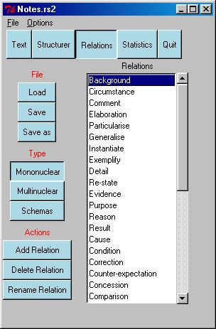
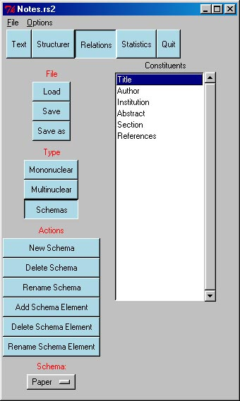

 

# 6. Dealing with Relations {#dealing-with-relations align="center"}

 

We call the set of relations associated with an RST file a *relations
set.* This section describes how to edit, load and save relations sets.

### 6.1 Types of Relations

The RSTTool deals with three types of relations:

1.  **Mononuclear Relations**: such as *Elaboration* and *Solutionhood*.
    These relations consist of a single nucleus and a single satelite.
2.  **Multinuclear Relations**: which link together a set of entities of
    equal status, e.g., *Joint*, *Sequence*, etc. A multinuclear node is
    created above the joined entities to represent the group as a whole.
3.  **Schemas**: which are like multinuclear groups, but each element of
    the group has a distinct functional label, e.g., the *Paper* schema
    may be defined to have elements *Title Author Abstract Section
    References*. Several elements may server the same function in a
    schema, e.g., we may have several *Section* nodes in a *Paper*
    analysis.

### 6.2 Editing the Relation Set

The Relations editor allows you to edit the relations defined for this
document. To open the relations editor, select *Edit Relations Set* from
the *Relations* Menu.

The relations are split into three sub-sections, mononuclear relations
(see figure 5); multinuclear relations; and schemas (see figure 6). You
can move between these sets using the *View* selector on the interface.
You can return to structuring.\
 

\
Figure 5: The Relations Editor: MononuclearRelations

\
Figure 6: The Relations Editor: Schemas

 

### 6.3 Saving and Loading Relation Sets

An RST document will either have a relations set defined within the
document header, or else it will have a pointer to a separate file
holding the relations, a *relations* *master*. When we save the
document, it will save the relations in the same way, i.e., embedded in
the header, or to a relations master.

#### 6.3.1 Changing the way relations are saved

You may wish to change the way the tool saves your relations with your
RST document. For instance, if relations are saved embedded in the RST
document, and you want them saved to a master, or visa versa. To do
this, select \"Save options\...\" under the \"Options\" menu. The
current state of affairs will be shown, and you can change it if you
wish.

Alternatively, the \"Load\", \"Save\", and \"Save as\" options in the
Relations Editor interface may change the default master file (see
below).

#### 6.3.2 Switching the Relations Set

You can switch to other relation master files if you need to. When in
the Relations Editor interface, select the *Load* button.

Note that this file will become the \"relations master\" file associated
with the current RST document. When you save that document, it will
inlcude a pointer to this relations master file, and the relations set
defined at that time will be saved to the relations master. To vary this
association, select \"Save options\" under the \"Options\" menu.

#### 6.3.3 Saving to a Relations Master

If the current relations set is associated with a relations master, you
can save any modifications to this set by pressing the \"Save\" button
on the Relations Editor interface. If there is no currently defined
relations master (the current set was embedded in the RST file), you
will be prompted to supply the name of one. This file will become the
relations master associated with the RST file, and when the RST file is
saved, the relations will be saved to the relations master, not embedded
in the RST file. If this is not your desire, see *Changing the way
relations are saved* above.

 

### 6.4 Relation Sets Provided with the Tool

RSTTool comes with some relation sets already provided, although you can
create your own. The provided ones are:

1.  **ClassicMT.rel**: Mann and Thompson Classic, as defined in Mann and
    Thompson 1988.
2.  **ExtMT.rel**: Mann and Thompson Extended, as provided by Bill Mann
    for analyses with the tool today. For a description of application
    critera of these relations, see: [here](RSTDefs.htm) (lifted from
    his web pages).
3.  **ExtMT-fr.rel**: Mann and Thompson Extended, in French. \[NEW\]
4.  **ExtMT-spa.rel**: Mann and Thompson Extended, in Spanish. \[NEW\]
5.  **Mick.rel**: Mick\'s Relation set, a mixture of RST and Systemic
    relations as he uses them.

