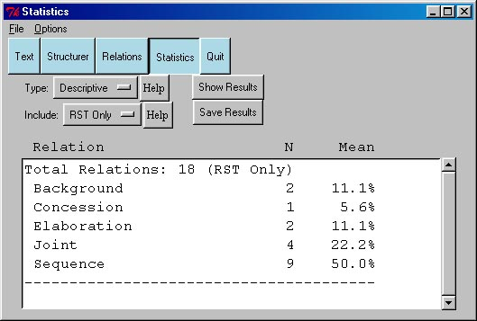

 

# 8. Statistics {#statistics align="center"}

 

This section will outline how to use the statistics pane. An instance of
this pane appears in figure 7.

{border="0"}

Figure 7: The Statistics Pane.

**Type**: At present, only descriptive statistics are available. (Soon,
I will add the ability to compare two RST analyses).

**Include**: This popup menu allows you to choose between:

-   **RST Only**: ignores all Schema relations in performing the
    calculations.
-   **RST+Schemas**: includes Schema relations in the calculation.

Note that we are counting in terms of how a text element links to its
parent, so that a joint relation over three satelites will count as
three Joint relations. If there is demand to count each Joint structure
as 1 instance, I will add an option for this.

**Show Results**: hit this button to perform the calculations and
display the results.

**Save Results**: Hit this button to save the results to a file.

\

------------------------------------------------------------------------

\
**\[NEW\] Proportion of Nuc\^Sat to Sat\^Nuc**: This last column shows
the proportion of the instances of this relation in which the nucleus
preceeds the satelite, and visa versa. This information is important for
people attempting to model satelite placement for different relations.

